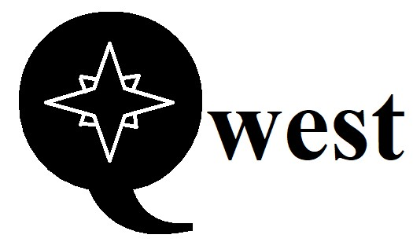

# Quest - A to-do app for devs




`Quest` is an application for creating *tasks* straight from the command line. The tasks are saved to a Markdown file in a  project's repository. This helps developers manage their work directly from their source code files. Also, the completed tasks show the project's history and evolution.


## How does it work?

Quest groups tasks by `features`, which are directories in your source code. So to start adding `tasks` you first need to create a "feature".

### Create a feature

You only need to run this command once per feature.

```PowerShell
quest feat create "Download Button" --path ./src/docs/ --desc "This is a download button in the About page..."
```

This command will create a file named `todo.md` in the following path:

      src/docs/.quest/DownloadButton/todo.md

The `todo.md` file will contain the following

```MD
# Download Button

This is a download button in the about page...
```

## Add tasks

Once you created a "feature" you can start adding tasks to it. Just run the following command:

```PowerShell
quest do "Format file content" feat "DownloadButton"
```

**quest:** This is the CLI

**do:** This command creates new tasks in the `todo.md` file.

**feat:** This is the name of the feature related to the new task. It is also the name of the directory holding the `todo.md` file.

The new *task* will be saved in your project's source code, in a path like this:

      .quest/<feature_name>/todo.md

The example above would be:

      .quest/DownloadButton/todo.md


